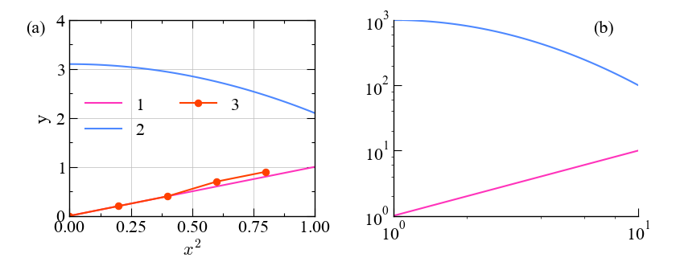
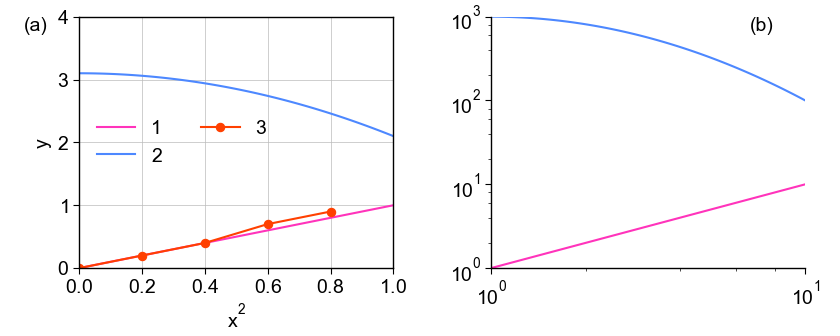

# lineutil

Utilities for plotting lines using matplotlib.

Available functions are

- New colormaps;
- Replacement for default fonts;
- Better-looking legends and ticks. Legend outside subplot;
- Labeling on subplots;
- Auto figure resizing by square subplots;
- Simple plotting from command line (`python -m lineutil`);

Requirements:

    Pandas
    Numpy
    Matplotlib

PRL style (serif fonts):

Nature style (sans-serif fonts):

### Quickstart

Shell:

    python -m lineutil -x [column_x] -y [column_y] [your_table_file_separated_by_space]

Shell (plotting two contrast sets of data):

    python -m lineutil -x [column_x] -y [column_y] -cm -cm "line.lighter" -s -s "linestyle=--" [your_table_file_separated_by_space]

Script:

    import lineutil
    lineutil.preset_prl()

    lineutil.set_prop_cycle() # Setting the line color loop
    # normal plotting
    ...

    lineutil.render_resized()

Script (plotting two contrast sets of data):

    import lineutil
    lineutil.preset_prl()

    lineutil.set_prop_cycle()
    # plotting dataset 1
    ...

    lineutil.set_prop_cycle(colormap='line.lighter', linestyle='--')
    # plotting dataset 2
    ...

    lineutil.render_resized()
