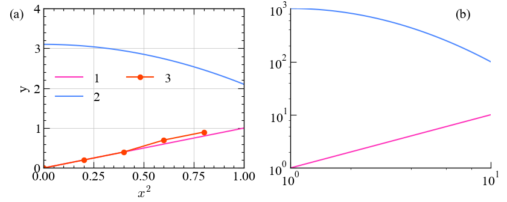

# lineutil

Utilities for plotting lines using matplotlib.

Available functions are

- New colormaps;
- Replacement for default fonts;
- Better-looking legends and ticks. Legend outside subplot;
- Labeling on subplots;
- Auto figure resizing by square subplots;
- Simple plotting from command line (`python -m lineutil`);

Requirements:

    Pandas
    Numpy
    Matplotlib

PRL style (serif fonts):

Nature style (sans-serif fonts):

### Quickstart

Shell:

    python -m lineutil -x [column_x] -y [column_y] [filename]

By defaults, the separator of file is any white characters (use `--sep` to change.) column_x and column_y may be integers (starting from 1) or string. column_y may also be slices ("1:5"). By default, column_x = 1, column_y = "2:".

Shell (line + scatter):

    python -m lineutil -x [column_x] -y [column_y] -s 'pt=o' [filename]

Shell (plotting two contrast sets of data):

    python -m lineutil -x [column_x] -y [column_y] -cm -cm "line.lighter" -s -s "linestyle=--" [file1] [file2]

Shell (plotting two data sequentially)

    python -m lineutil -x [x_file1] -y [y_file1] -x [x_file2] -y [y_file2] --append [file1] [file2]

Script:

    import lineutil
    lineutil.preset_prl()

    lineutil.set_prop_cycle() # Setting the line color loop
    # normal plotting
    ...

    lineutil.render_resized()

Script (plotting two contrast sets of data):

    import lineutil
    lineutil.preset_prl()

    lineutil.set_prop_cycle()
    # plotting dataset 1
    ...

    lineutil.set_prop_cycle(colormap='line.lighter', linestyle='--')
    # plotting dataset 2
    ...

    lineutil.render_resized()

### Colormap References

The leftmost one is reference color, and will not be enabled by default (unless use `lineutil.set_prop_cycle(skip_header=False)`).

